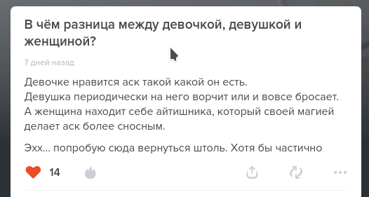

## 1coin.user.js

Restore 1 click = 1 coin (not 5 coins) behavior.

The UI updates after a short pause. Multiple clicks in a row also work correctly.

## themes.user.js

Restore the choice from 18 color themes (selectable in the userscript manager menu).

As ASKfm's style and layout are evolving, old CSS may not work smoothly / not work at all. Currently I've added a manual fix for red button borders. Help with adapting old styles for the new layout will be appreciated.
